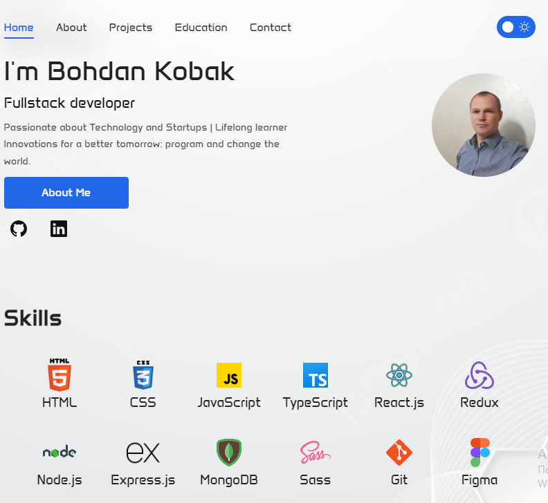
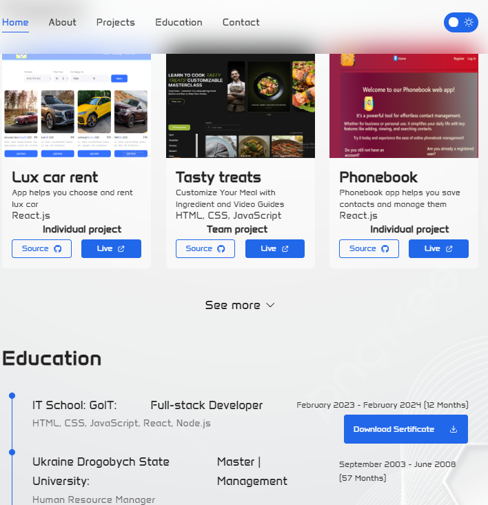
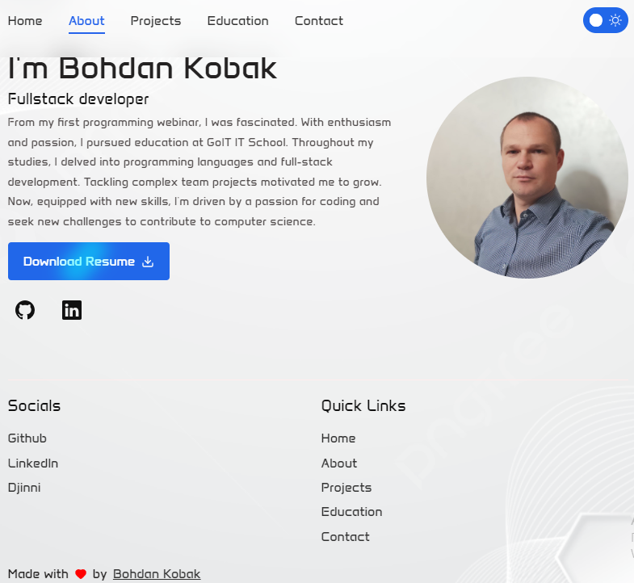
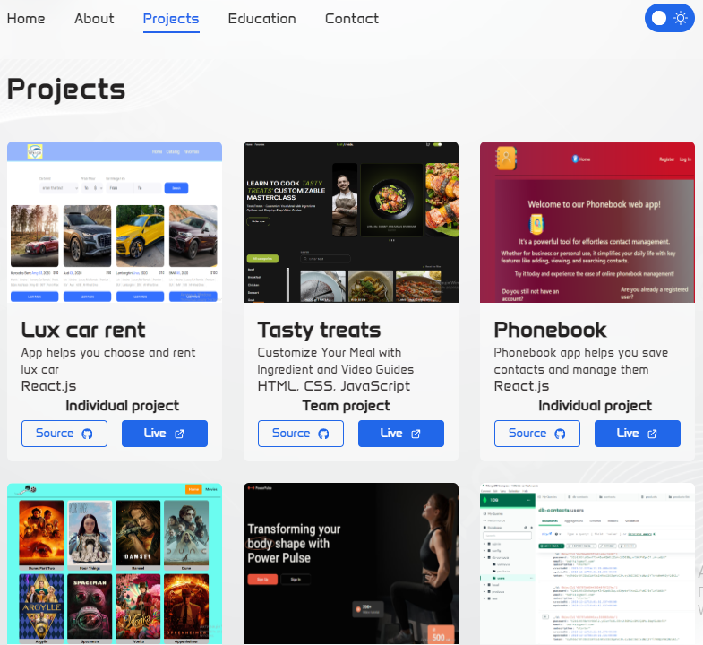
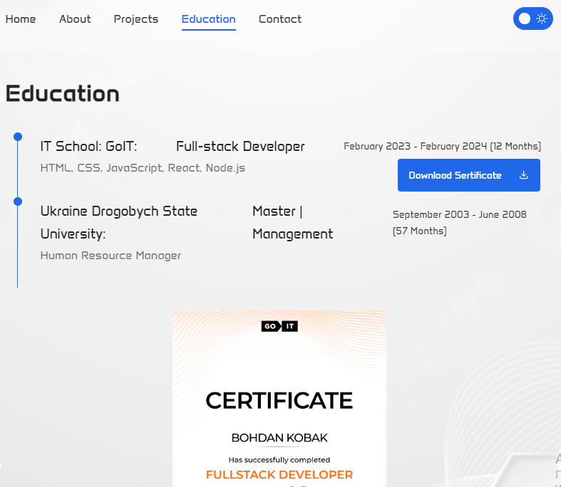
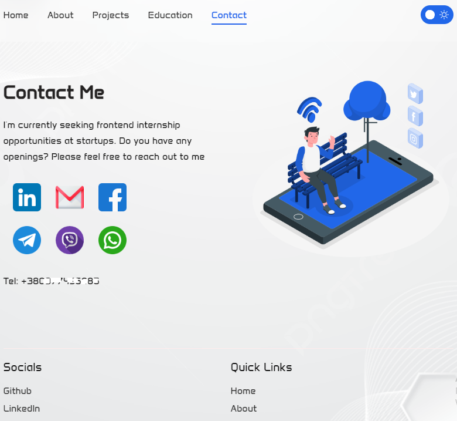

# My Portfolio App

his React application serves as a portfolio showcasing my skills, projects,
education, and contact information. This project was created with [Create React
App].

## Installation

To run this project locally, follow these steps:

1. Clone this repository.
2. Navigate to the project directory.
3. Run `npm install` to install dependencies.
4. Run `npm start` to start the development server.

## Features

- **Home Page**: Displays an introduction, skills, featured projects, education,
  and freelance availability. 
  
- **About Page**: Provides information about myself and my background. Also you
  can download my resume. 
- **Projects Page**: Lists all my projects with details. There are my personal
  projects and team projects where i was a developer and Scrum-Master.
  
- **Education Page**: Highlights my educational qualifications.
  
- **Contact Page**: Allows users to get in touch with me.
  

## Usage

Simply navigate through the different pages using the navigation bar at the top
to explore my portfolio.

## Dependencies

- `react`: Frontend JavaScript library for building user interfaces.
- `react-router-dom`: Provides routing capabilities for React applications.
- `react-icons`: Library providing a set of high-quality icons.
- `react-markdown`: Allows rendering Markdown as React components.
- `react-scripts`: Configuration and scripts for Create React App.

## Credits

This project was created by [Your Name].
